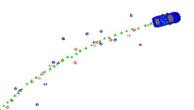
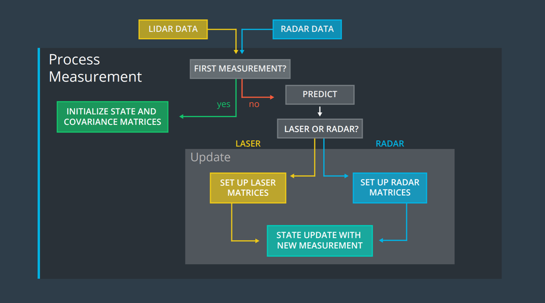

# Extended Kalman Filter

## Goal

* Utilize a kalman filter to estimate the state of a moving object
 with noisy lidar and radar measurements.

* RMSE values of Object position(px, py), object speed(vx, vy) <= [.11, .11, 0.52, 0.52].

## Input and Output

* INPUT: values provided by the simulator to the c++ program

        ["sensor_measurement"] => the measurement that the simulator observed (either lidar or radar)

* OUTPUT: values provided by the c++ program to the simulator

        ["estimate_x"] <= kalman filter estimated position x
        ["estimate_y"] <= kalman filter estimated position y
        ["rmse_x"]
        ["rmse_y"]
        ["rmse_vx"]
        ["rmse_vy"]

## Pipeline

## Code

* Main

src/main.cpp calls fusionEKF.ProcessMeasurement(measurement_pack_list[k]),
 the code in FusionEKF.cpp will run. - If this is the first measurement,
 the Kalman filter will try to initialize the object's location with the
 sensor measurement.

* KalmanFilter Class

src/kalman_filter.h defines the KalmanFilter class containing the x vector
as well as the P, F, Q, H and R matrices. The KalmanFilter class also
contains functions for the prediction step as well as the Kalman filter
update step (lidar) and extended Kalman filter update step (radar).
