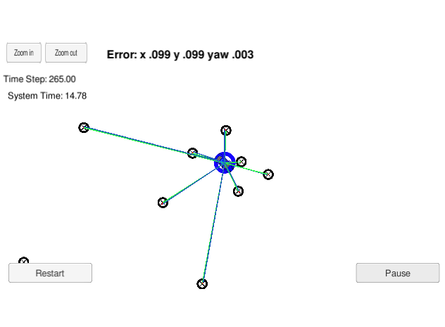
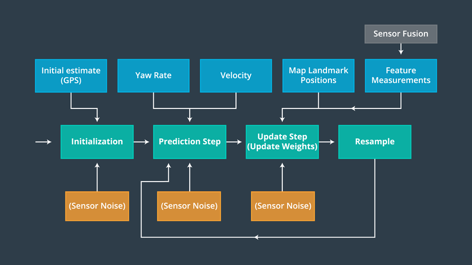

# Particle Filter

## Goal
Implement a 2 dimensional particle filter in C++. It will be given a map
and some initial localization information (analogous to what a GPS would provide). At each
time step the filter will also get observation and control data, to localize the vehicle
to within the desired accuracy

## Input and output

Input from simulator:

    ["sense_x"] // noisy position data from the simulator
    ["sense_y"]
    ["sense_theta"]
    ["previous_velocity"] // previous velocity and yaw rate to predict the particle's transitioned state
    ["previous_yawrate"]
    ["sense_observations_x"] // noisy observation data from the simulator,
    ["sense_observations_y"]

OUTPUT by the c++ program to the simulator:

    ["best_particle_x"] // best particle values used for calculating the error evaluation
    ["best_particle_y"]
    ["best_particle_theta"]
    ["best_particle_associations"]// for respective (x,y) sensed positions ID label
    ["best_particle_sense_x"] <= list of sensed x positions // for respective (x,y) sensed positions
    ["best_particle_sense_y"] <= list of sensed y positions

## Pipeline

## Code

* Main

src/main.cpp calls the function in Particle filter to initialize, predict, update weights, resample,
and also get the assiciation between the sensed and actual object for debugging.

* ParticleFilter Class

src/particle_filter.h defines the Particle class containing all the particles, and their
weights.
