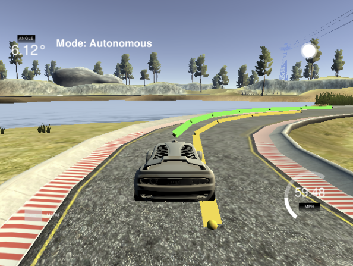

# Model Predictive Control

---

## Goal
Implement Model Predictive Control in C++ to drive the car around the track.
 
Simulator gives the xy coordinates of waypoints, vehicle current xy coordinates, orientation,
steering_angle, throttle and speed. Additionally, there's a 100 millisecond latency between 
actuations commands on top of the connection latency.

Model output throttle and steering angle to vehicle.

## Code
* Model
    * State
      
            x, y: vehicle coordinates      
            v: vehicle speed
            psi: vehicle orientation
            cte: cross track error
            epsi: Orientation Error
    
    * Actuators
    
            delta: steering angle
            a: throttle
    
    * Update equation
          
            x_[t+1] = x[t] + v[t] * cos(psi[t]) * dt
            y_[t+1] = y[t] + v[t] * sin(psi[t]) * dt
            psi_[t+1] = psi[t] + v[t] / Lf * delta[t] * dt
            v_[t+1] = v[t] + a[t] * dt
            cte[t+1] = y[t] - f(x[t]) + v[t] * sin(epsi[t]) * dt
            epsi[t+1] = psi[t] - psides[t] + v[t] * delta[t] / Lf * dt

      Lf: a constant measures the distance between the center 
      of mass of the vehicle and it's front axle. The larger the vehicle, 
      the slower the turn rate.
    

* Timestep Length and Elapsed Duration (N & dt)
    
    MPC attempts to approximate a continuous reference trajectory by 
    means of discrete paths between actuations.

        N: Number of Timesteps. Higher number cause more computation.
        dt: Timestep Duration. Larger value result in coarse discretization.
      
  Since model is re-calculated everytime, and only first steps is used for 
  actuation, N*dt is selected just big enough to fit the next turn curve in front
  of car. dt is selected at 100 ms, too big cause too much discretization error,
  while too small cause too much computation because N must increase to cover same 
  distance in front of car.  
      
    

* Polynomial Fitting and MPC Preprocessing
    
    * A polynomial of order of 3 is fitted to way points.
    * Before MPC procedure all the coordinates are converted to the current vehicle coordinate
    so that, vehicle at xy(0,0) and orientation 0.

* Model Predictive Control with Latency
    
    * Using the same update equations to calculate the state of vehicle in 100 ms.
    * This resulting state is the initial state to feed into MPC procedure.
    * The MPC output will be right for vehicle after latency.
    
