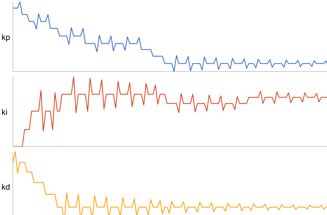
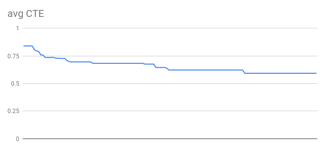

# PID Control

---

## Goal
Implement a PID controller in C++ to maneuver the vehicle around the track.
The simulator provides the cross track error (CTE) and the velocity (mph) in order to compute the appropriate steering angle.

## Code
* Proportional–integral–derivative (PID)
  * Applies a correction(kp) based on proportional term, to correct the current error.
    * it applies corrective steering angle based on the error.
  * Applies a correction(ki) based on integral term, which increases action in relation not only to the error but also the time for which it has persisted, such as system bias.
    * it applies corrective steering angle to the persistent error.
  * Applies a correction(kd) based on derivative terms, it consider the rate of change of error, aims at damping the force applied.
    * it reduces the steering correction when the error is being corrected, hence less oscillation.

* Optimize parameters by twiddle
  * move the paramters up or down based on the average CTE after run for a lap
  * start with kp = -0.060000, ki = -0.000380, kd= -0.700000
  * final chosen parameter are kp = -0.083349, ki = -0.000382, kd = -0.783738
  

