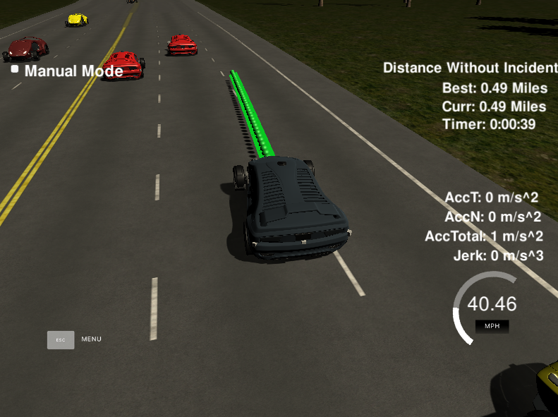

# CarND-Path-Planning-Project

### Goals
In this project your goal is to safely navigate around a virtual highway with 
other traffic that is driving +-10 MPH of the 50 MPH speed limit. It will 
be provided that the car's localization and sensor fusion data, there is also a 
sparse map list of waypoints around the highway. The car should try to go as 
close as possible to the 50 MPH speed limit, which means passing slower traffic 
when possible, note that other cars will try to change lanes too. The car should
 avoid hitting other cars at all cost as well as driving inside of the marked road 
 lanes at all times, unless going from one lane to another. Also the car s
 hould not experience total acceleration over 10 m/s^2 and jerk that is greater than 10 m/s^3.

## Code
* Model
    * State
      
            selected_lane: currently selected lane to drive.
            lane_change: if the car is changing lane.
    
    * direct action at each step
    
            considerLaneChange: if there is car 30 m in front.
            slowdown: if there is car 10 m in front.
            accelerate: if there is no car 20 m in front.
            
    * lane change
            
            if considerLaneChange and not in the process of changing lane:
                if neighbor lane is better: 
                    lane_change = true 
                    selected_lane = neighbor lane
                if the best lane is not neighbor, but mid lane is feasible to drive:
                    lane_change = true 
                    selected_lane = mid lane
                    (it goes to the best lane in next lane change)
                   
    * Generating path
    
            If there is previous path point, then take 25 points or 10 points (if slowdown or accelerate)
            otherwise use current position.
            Pick another 3 points in selected_lane 30, 60, 90 m in front of car, fit the spline.
            Using fitted spline, based on car speed, add point for every 0.02 s car moves.
            
        
    

* Timestep Length and Delay
    
    The model provide 50 points (0.02 * 50 = 1 seconds) of path at every calculation, and at 10 of them are from
     previous path. so there is buffer even if path is provided after car passed first couple of the way points in path. 
      
    

  
