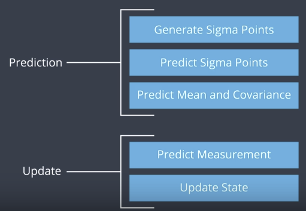

# Unscented Kalman Filter

## Goal

* Utilize an Unscented Kalman Filter to estimate the state of a moving object of interest with noisy lidar and radar measurements.

* RMSE values of Object position(px, py), object speed(vx, vy) <= [.09, .10, .40, .30].

## Input and Output

* INPUT: values provided by the simulator to the c++ program

        ["sensor_measurement"] => the measurement that the simulator observed (either lidar or radar)

* OUTPUT: values provided by the c++ program to the simulator

        ["estimate_x"] <= kalman filter estimated position x
        ["estimate_y"] <= kalman filter estimated position y
        ["rmse_x"]
        ["rmse_y"]
        ["rmse_vx"]
        ["rmse_vy"]

## Pipeline

Similar to extended Kalman filter, there are prediction and update steps. Unlike
 extended Kalman filter, it does not need to linearize non-linear functions;
 instead, the unscented Kalman filter takes representative points from a
 Gaussian distribution

## Code

* Main

src/main.cpp reads in data, calls a function to run the 
Unscented Kalman filter, calls a function to calculate RMSE

* UKF Class

src/UKF.h initializes the Unscented Kalman filter, defines the predict and update functions
