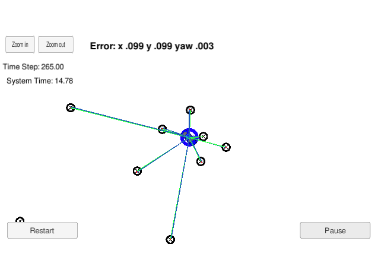

# Self Driving Car Projects

## Computer vison and deep learning

1. [Traffic Sign Recognition](/CarND-Traffic-Sign-Classifier-Project2)

Train a deep learning model with technique like relu, dropout, pooling to 
make predictions on new images and analyze the softmax probabilities

2. [Vehicle Detection](/CarND-Vehicle-Detection)

Transform image, extract HOG feature, build a supporting vector machine classifier,
with sliding-window technique, use trained classifier to search for vehicles on a video stream

3. [Behavioral Cloning](/CarND-Behavioral-Cloning-P3)

Build a convolution neural network in Keras that predicts steering angles from images, 
 drives around track without leaving the road

4. [Advanced Lane Finding](/CarND-Advanced-Lane-Lines2)

 

Calibrate the camera, correct, color and gradient threshhold, and rectify the image,
detect lane boundary,  determine the lane curvature and vehicle position
 
## Sensor fusion

1. [Extended Kalman Filter](/CarND-Extended-Kalman-Filter-Project)

2. [Unscented Kalman Filter](/CarND-Unscented-Kalman-Filter-Project)

Implement Extended/ Unscented Kalman Filter to fuse the radar sensor and lidar sensor data
to tract and estimate the vehicle state.

## Localization

1. [Particle Filter](/CarND-Kidnapped-Vehicle-Project)

Implement particle filter to localize the vehicle at each time step with 
observation and control data.

## Control

1. [PID Control](/CarND-PID-Control-Project)

Implement a PID controller to maneuver the vehicle around the track with
cross track error (CTE) and the velocity (mph) provided from simulator.

2. [Model Predictive Control](/CarND-MPC-Project)

Implement Model Predictive Control, using xy coordinates of waypoints and vehicle
state from simulator to output throttle and steering angle to vehicle with 
100 millisecond latency.

## Path Planning

1. [Path Planning](/CarND-Path-Planning-Project)

Safely navigate around a virtual highway with other traffic, make decisions like
accelerate, brake, change lanes based on the vehicle state and sensor fusion data.
